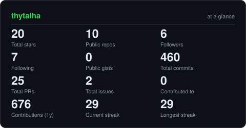

  <h1>Hi there! I'm Talha Pasha 👋</h1>

  

## 💻 Tech Stack & Tools

   
    
    
    
    
    
    
    
    
    
    
    
    
    
    
    
    
    
    
    
    
  
  
  
  
  
    

## 🏆 Featured Projects

  
| Project | What it is |
|--------|------------|
| [🩸 **Blood Bank MS**](https://github.com/thytalha/Blood-Bank) | A repository facilitating life-saving blood donations through donor-patient connectivity.|
| [🌦️ **Weather App**](https://github.com/thytalha/Weather-App) | A lightweight weather app that fetches and displays current weather data in a simple interface.|
| [🐦 **Flappy Bird**](https://github.com/thytalha/Flappy-Bird) | Flappy Bird remake in C++ & SFML with menus, difficulty modes, music, and leaderboard. |
| [🏦 **Banking System**](https://github.com/thytalha/Cash-Flow) | Desktop banking and cash flow management system built with C++ and WinForms. |
| [🧱 **Brick Breaker**](https://github.com/thytalha/Brick-Breaker) | Console Brick Breaker using Win32 GDI: paddle, ball physics, colored bricks, scoring. |
| [🚢 **Battleship Game**](https://github.com/thytalha/Battleship) | C++ console Battleship: 2‑player grid, ship placement with coordinates, turn‑based attacks. |
| [❌ **Tic Tac Toe**](https://github.com/thytalha/Tic-Tac-Toe) | Classic 2‑player Tic‑Tac‑Toe in the terminal, built in C++ with clean input handling. |
| ♟️ **Chess Game** | Terminal chess project focused on board logic, piece movement rules, and turn management. |

## 🎯 Skill Radar

<table>
<tr>
<td width="50%" align="center" valign="middle">

<!-- Self-rated radar - edit assets/skills.json, the workflow redraws it -->
<picture>
  <source media="(prefers-color-scheme: dark)"  srcset="assets/radar-dark.svg">
  <source media="(prefers-color-scheme: light)" srcset="assets/radar-light.svg">
  
</picture>

</td>
<td width="50%" align="center" valign="middle">

<!-- Live radar built from real language byte counts across your repos -->
<picture>
  <source media="(prefers-color-scheme: dark)"  srcset="assets/radar-langs-dark.svg">
  <source media="(prefers-color-scheme: light)" srcset="assets/radar-langs-light.svg">
  
</picture>

</td>
</tr>
</table>

---

## 📅 Contribution Calendar

<!-- 3D isometric calendar, regenerated every 6h by .github/workflows/metrics.yml -->

  

---

## 📈 The Numbers

<!-- Generated by scripts/cards.py into this repo. Deliberately NOT
     github-readme-stats / streak-stats / github-profile-trophy: those are
     shared public instances that go down and take the whole section with them. -->
<picture>
  <source media="(prefers-color-scheme: dark)"  srcset="assets/card-stats-dark.svg">
  <source media="(prefers-color-scheme: light)" srcset="assets/card-stats-light.svg">
  
</picture>

 

## 🌐 Connect With Me

